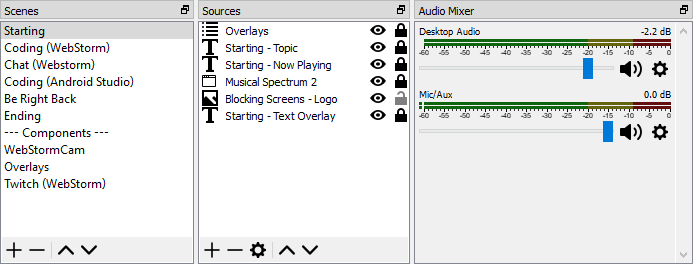
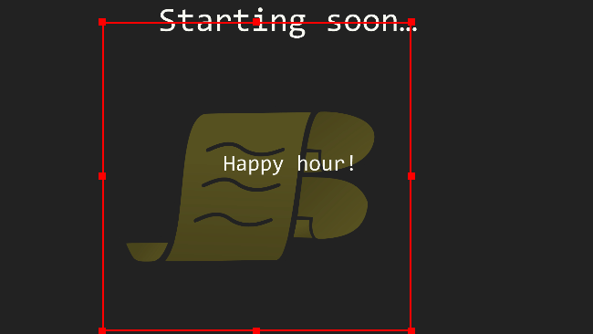
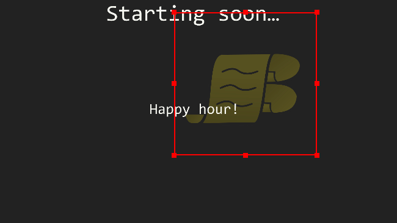
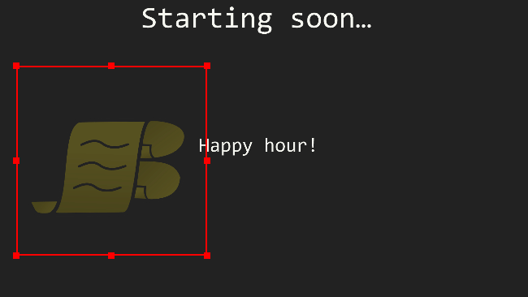
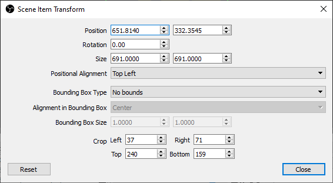
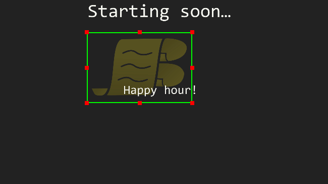
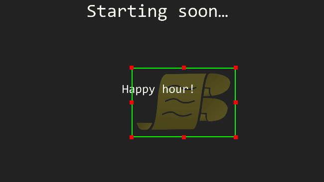

I wrote some [Lua](https://www.lua.org/) for the first time last night to bounce scene items around in [Open Broadcaster Software](https://obsproject.com/) (OBS), in the style of the [bouncing DVD logo](https://www.bouncingdvdlogo.com/).

I've always wanted to play about with Lua, as my younger kids are [Roblox](https://www.roblox.com/) mad and it's the language used to script games in [Roblox Studio](https://www.roblox.com/create), so that's potentially a way to get them into coding in the future…

## Demo

Here's a demo of the finished script bouncing a background logo around in an OBS scene (sound ON):

`youtube:https://www.youtube.com/watch?v=FbtzencagAM`

## Anatomy of an OBS scene

When you're using OBS, you create **scenes** which contain the different elements you want to display, which are known as **sources**.



Scenes can also contain other scenes, so they can be used a bit like a UI component model to break the final UI you want to create into smaller, reusable chunks. For example, it's common to have a scene containing anything you want to appear as an overlay (such as notifications) and include that as the top layer in every other scene you create.

When you're using the [OBS API](https://obsproject.com/docs/scripting.html), a **scene** is an `obs_scene_t` object and a **source** within a scene is an `obs_sceneitem_t` object, but they're both *also* `obs_source_t` objects. In fact, *everything* you can see in the screenshot above is a `obs_source_t` object, including the audio inputs.

This is something you have to keep in mind, as different API methods require the use of specific object types. For example, the [API functions to get the width and height of a source](https://obsproject.com/docs/reference-sources.html#c.obs_source_info.get_width) take an `obs_source_t` as input, but the [function to get the position of a source within a scene](https://obsproject.com/docs/reference-scenes.html#c.obs_sceneitem_get_pos) takes an `obs_sceneitem_t`.

## Finding a scene item

The first thing the script needs to do is find a scene item by name within the current scene.

The fun begins immediately, as the [`obs.obs_frontend_get_current_scene()`](https://obsproject.com/docs/reference-frontend-api.html#c.obs_frontend_get_current_scene) function actually returns an `obs_source_t`, so we need to use it to get a reference to an `obs_scene_t` in order to search for the scene item:

```lua
local source = obs.obs_frontend_get_current_scene()
local scene = obs.obs_scene_from_source(source)
-- more on this line later…
obs.obs_source_release(source)
-- scene_item is a variable already declared at the module level
scene_item = obs.obs_scene_find_source(scene, source_name)
```

If you guessed that [`obs.obs_scene_find_source()`](https://obsproject.com/docs/reference-scenes.html#c.obs_scene_find_source) would return an `obs_sceneitem_t` because that's the opposite of what it says it does, you guessed correctly 🙂

## Position and dimensions

In order to move a scene item around, we need to know 3 things:

1. Its current position
2. Its dimensions (width and height)
3. The dimensions of the scene it's in

```lua
local pos = obs.vec2()
obs.obs_sceneitem_get_pos(scene_item, pos)
-- the functions for width and height need an obs_source_t
local source = obs.obs_sceneitem_get_source(scene_item)
local width = obs.obs_source_get_width(source)
local height = obs.obs_source_get_height(source)
-- note that we don't use obs.obs_source_release(source) here…
```

For the scene dimensions, we can go back and do this when we're looking for the scene item:

```lua
local source = obs.obs_frontend_get_current_scene()
local scene = obs.obs_scene_from_source(source)
-- module level variables
scene_width = obs.obs_source_get_width(source)
scene_height = obs.obs_source_get_height(source)
obs.obs_source_release(source)
```

## Movement code

Before I started, I thought I'd have to figure out the maths for velocity and bounce angles, thankfully it turns out you don't need to for linear movement.

For each frame it's rendering, OBS will call a [`script_tick()`](https://obsproject.com/docs/scripting.html#script_tick) function provided by our script.

On each tick, we need to look at the current position of the scene item's box, determine if there's room for it to move in its current direction and move it by a number of pixels (its `speed`) in that direction.

In the following code, direction is controlled by a pair of booleans: `moving_right` for horizontal direction (`true` = right, `false` = left) and `moving_down` for vertical direction (`true` = down, `false` = up):

```lua
local speed = 10
local next_pos = obs.vec2()

-- calculate the next horizontal position
if moving_right and pos.x + width < scene_width then
   next_pos.x = math.min(pos.x + speed, scene_width - width)
else
   moving_right = false
   next_pos.x = math.max(pos.x - speed, 0)
   if next_pos.x == 0 then moving_right = true end
end

-- calculate the next vertical position
if moving_down and pos.y + height < scene_height then
   next_pos.y = math.min(pos.y + speed, scene_height - height)
else
   moving_down = false
   next_pos.y = math.max(pos.y - speed, 0)
   if next_pos.y == 0 then moving_down = true end
end

-- move the scene item to its new position
obs.obs_sceneitem_set_pos(scene_item, next_pos)
```

Here's our initial movement code in action:



## Resized scene items

The logo we're bouncing around is quite big, so it doesn't have much room to move, which makes the bouncing effect a bit jarring.

What happens if we resize it in OBS?



Our script is still getting the original size of the source, so it's bouncing in the same pattern.

When you resize a scene item in OBS, it applies a scaling factor, which we need to account for when determining the scene item's dimensions:

```lua
local scale = obs.vec2()
obs.obs_sceneitem_get_scale(scene_item, scale)
local width = round((obs.obs_source_get_width(source) * scale.x)
local height = round((obs.obs_source_get_height(source) * scale.y)
```



## Cropped scene items

Our resized logo has a chunk of transparent space around it, so it still looks like it's bouncing around the middle of the scene.

OBS also allows you to crop scene items, so we can crop out the extra space instead of creating a separate version of the logo:





Once again, we'll need to account for the cropped area when determining the scene item's dimensions. Cropping is done against the source's original size, so we'll need to subtract the cropped area before accounting for scaling:

```lua
local crop = obs.obs_sceneitem_crop()
local crop = obs.obs_sceneitem_get_crop(scene_item, crop)
local width = round(
   (obs.obs_source_get_width(source) - crop.left - crop.right) * scale.x)
local height = round(
   (obs.obs_source_get_height(source) - crop.top - crop.bottom) * scale.y)
```



## Final script

The full source for the final script is here:

https://github.com/insin/obs-bounce/blob/master/bounce.lua

Extra details we haven't gone into are left as an exercise for the reader:

- Setting up configuration UI, with a dropdown list of source names
- Toggling starting and stopping with a button or an OBS hotkey
- Returning the source item to its original position when stopped

## Addendum 1: TIL OBS Scripting API

### C-style APIs are a bit of a PITA

Having to create an object then pass it into a function call to populate it is just noise when you're writing and reading code, so I ended up writing my own wrappers for these:

```lua
--- convenience wrapper for getting a scene item's pos in a single statement
function get_scene_item_pos(scene_item)
   local pos = obs.vec2()
   obs.obs_sceneitem_get_pos(scene_item, pos)
   return pos
end
```

I also found an API function [which needs a wrapper for scripting compatibility but doesn't have one](https://github.com/obsproject/obs-studio/issues/2788).

### But do pretend you're writing C!

The following warning in the documentation is not to be trifled with:

> Please treat the API bindings as though you were writing a C program: read the documentation for functions you use, and release/destroy objects you reference or create via the API.

After using [`obs_frontend_get_current_scene()`](https://obsproject.com/docs/reference-core.html#c.obs_get_source_by_name) to get a reference to the source object for the current scene, an earlier version of the script didn't release its reference with `obs_source_release(source)`, which caused OBS to crash on exit with a very… not-helpful error message.

As you're writing a script, you need to pay attention to the API documentation for each function you're using - as you've seen, function names are not always your friend.

If the docs say a function returns "a new reference" or explicitly point you to the the relevant release function, you'll *need* to release the reference when you're finished with it.

If the docs say "does not increment the reference", you're good.

Perhaps adopting a variable naming convention such as a `_ref` suffix for anything which needs to be released later would help?

## Addendum 2: TIL Lua

I didn't have to do anything which required me to get deep into Lua when writing this script - I only bumped into intriguing terms like "metamethods" when browsing the docs - so these are pretty limited.

### Lua has a dedicated string concatenation operator

I can't remember having used one of these before.

```lua
print('width=' .. width .. ', height=' .. height)
```

### Lua doesn't have an array type

Lua has a table type which is an associative array. Instead of a dedicated array type (like JavaScript's `Array`, which is effectively managing an `Object` with numeric keys under the hood), you use a table with numeric keys and [table manipulation functions](http://www.lua.org/manual/5.2/manual.html#6.5) which do the right thing with numeric keys:

```lua
local names = {}
table.insert(names, 'Lynn Benfield')
table.insert(names, 'Alan Partridge')
table.sort(names, function(a, b)
   return string.lower(a) < string.lower(b)
end)
```

### Lua doesn't provide a `math.round()` function

The `round()` function used in the examples above is our own:

```lua
--- round a number to the nearest integer
function round(n)
   return math.floor(n + 0.5)
end
```

### I didn't mind the `end` syntax

`if`, `for`, `function` etc. statements must end with `end`. Using a 3-space indent ties in with `end` in a visually pleasing way.

I didn't like these much in Ruby, turns out I just didn't like Ruby 😜
