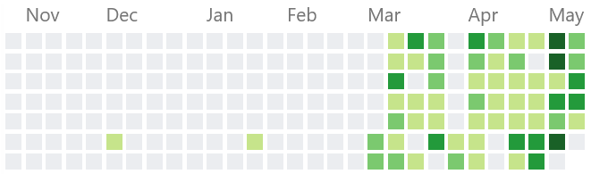

_Since the start of the COVID-19 lockdown in Australia, [my GitHub contributions](https://github.com/insin) have gone from 6 months of grey nothingness to a forest of green, perhaps I'm using it as a coping mechanism? Here's what I've been working on:_

### "Workouts" app clone 🏋️

Since my gym closed down, I decided to start making a clone of the app it had been using for posting Workouts of the Day and logging results, to keep learning more [Flutter](https://flutter.dev/) and to try [Cloud Firestore](https://firebase.google.com/docs/firestore) for the first time – I developed it entirely on Android but this is me trying it on the iPhone Emulator for the first time:

`youtube: [Workouts app clone demo](https://www.youtube.com/watch?v=DvWJgZKj7cw)`

I've learnt so much from doing this, including implementing a signup/login flow with [Firebase Auth](https://firebase.google.com/docs/auth), using [Firebase Cloud Storage](https://firebase.google.com/docs/storage/) to store images from users, how to get fancy with [custom screen transitions in Flutter](https://codepen.io/jbscript/pen/KKdWXOe), and how to implement, uh… that thing where a sticky UI element slides in/out as an overlay when you scroll down and up again – does that have a specific name?

### VLC Remote 📡

Merging [an epic Pull Request](https://github.com/insin/vlc_remote/pull/10) from a user of the Flutter [VLC Remote app](https://github.com/insin/vlc_remote#vlc-remote) I started making for myself a while back also got me back into developing it, and I've since been adding as many features and as much polish as I can for the sake of learning. Here's a demo of a recent version in action:

`youtube: [VLC Remote demo](https://www.youtube.com/watch?v=8eXJX4GVGhA)`

I'm currently in the middle of redesigning its controls, having just figured out how to implement [a nice full-width slider](https://codepen.io/jbscript/pen/dyYjEGe) which acts as a floating divider between the playlist and controls.

I've also started breaking out some of the individual Flutter UI things I've learnt into a [Flutter UI Bits and Pieces Codepen collection](https://codepen.io/collection/nqpzvz), using title names containing phrases I failed to find help with when searching for these things myself.

### nwb returns 🔥

I also brought [nwb, a React/Preact/Inferno toolkit](https://github.com/insin/nwb#nwb) I created in the pre-[create-react-app](https://create-react-app.dev) days back to life after an 18-month hiatus, by finishing the Babel 7 upgrade branch I started in January 2018! Despite what they say about the JavaScript ecosystem, Babel and Webpack were still at the same major version as when I stopped maintaining it.

It now has support for using the [new automatic runtime in Babel's React transform](https://babeljs.io/docs/en/babel-preset-react#react-automatic-runtime) with the experimental build of Reactit depends on, and the [latest, offical React hot reloading implementation](https://github.com/facebook/react/issues/16604#issuecomment-528663101), which has come on leaps and bounds since I was away.

Here's a recent demo of one of the main features I keep it around for:

`youtube: [Demo of react run, an nwb command for running React code without setting up an app](https://www.youtube.com/watch?v=U0DwgoYq5WI)`

### Babel and TypeScript things 🤓

I accidentally took a head-first dive into TypeScript type definitions and back into writing Babel AST transforms – a particular phrase ("host elements") [in a tweet about not being able to use HTML attributes in React](https://twitter.com/chantastic/status/1255876771188109312) gave me an idea for a new major version of [babel-plugin-react-html-attrs](https://github.com/insin/babel-plugin-react-html-attrs), a Babel plugin I had written to do basic `class` → `className` and `for` → `htmlFor` transforms on JSX attribute names.

It now lets you use _all_ HTML attributes on host elements in JSX, and I ended up spending too much of a weekend [forking the React type definitions](https://github.com/DefinitelyTyped/DefinitelyTyped/pull/44416#issuecomment-622717293) off the back of it, to add support for using all numeric and boolean HTML attributes and transforming them to the form React expects.

### [My first Lua and OBS Script](/my-first-lua-and-obs-script/)

### Twitter Twoke Tweak New Twitter 🐦

At the start of April, Twitter broke [Tweak New Twitter – my extension for making it halfway tolerable](https://github.com/insin/tweak-new-twitter#tweak-new-twitter), so I went back to maintaining that, making it capable of stripping even more crap out of your timeline and making the separated Retweets timeline it adds to Twitter more robust.

`youtube: [Demo of Tweak New Twitter](https://www.youtube.com/watch?v=j-pVrUWEAQk)`

### Deeper into Gatsby

I also dove much deeper into [Gatsby](https://www.gatsbyjs.org/) than my previous experience with it getting this blog set up by tweaking a template, as my wife needed to set up a marketing website quickly for a new business being spun out at her work.

I've ended up with a setup which is easily reusable for the next site, easy to edit for non-technical users, and is zero cost for a really decent amount of functionality (mostly thanks to [Netlify](https://www.netlify.com/)).

The setup for hooking [Netlify CMS](https://www.netlifycms.org/) up with Gatsby is a bit mind-bending at first, but using frontmatter in Markdown for content for as many sections as you want to be editable in the CMS, then pulling them out with GraphQL and feeding them into a page template (a template which you also hook into the CMS for live previews!) is a really neat solution.

While I was in Gatsby-land, I noticed [the plugin I created to help implement dark mode](https://github.com/insin/gatsby-plugin-dark-mode) was suffering from [the classic incorrect initial render issue](https://joshwcomeau.com/gatsby/dark-mode/#adding-a-toggle) everyone who tries to implement it eventually bumps into, so I fixed that too and [had some fun deciding](https://www.deviantart.com/heartstringsxiii/art/Scary-Sun-And-Moon-340588973) what the new toggle on my own site would look like.

### Back in Hackereact ⚛

I even went back and resurrected my (OG) [React Hacker News API client](https://github.com/insin/react-hn) as there was a new feature I wanted to add to it: [a new story list containing every item you've viewed the comment thread for](https://insin.github.io/react-hn/#/read), displayed in reverse-chronological order for ease of reading new comments on them.

_\* apologies to Stephen Colbert_
