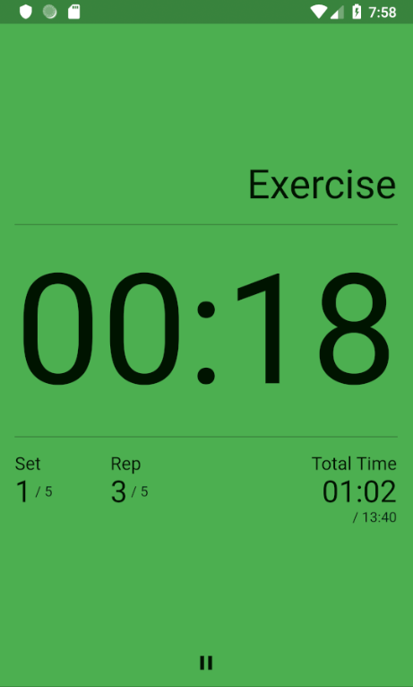
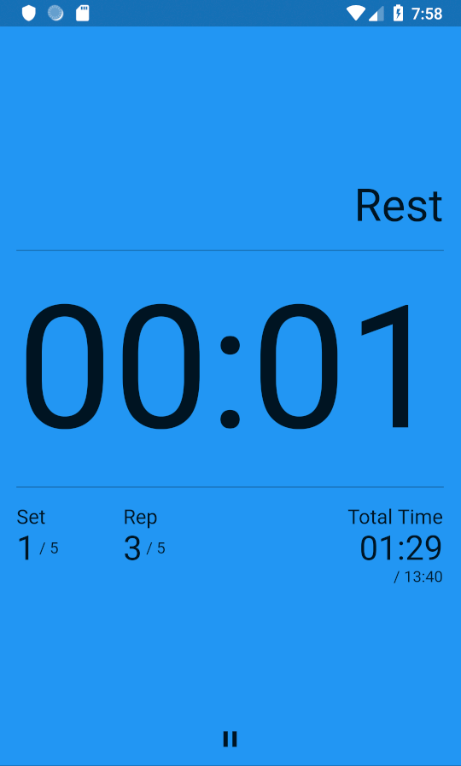

During a Tabata workout at my Wednesday group fitness class, our trainer's phone was propped up in the corner while she was moving around checking people's form

The timer app she was using was doing the things you'd expect:

- Large countdown timer text so it can be read from across the room.
- Countdown pips so we knew when the suffering was about to end (finishing on 6 rounds of burpees into jumping pull-ups 💀).

I noticed it was also doing something [the Android Tabata timer app](https://play.google.com/store/apps/details?id=jbscript.timerapp) I wrote to learn [Flutter](https://flutter.io/) and [Dart](https://www.dartlang.org) doesn't do - the workout screen changed colour so it was easy to tell at a glance what we should be doing.

Since Flutter is lovely in many of the same ways [React](https://reactjs.org/) is, this was an easy enough feature to add to the app's `WorkoutScreen`:

```dart
class _WorkoutScreenState extends State<WorkoutScreen> {
  // ...

  // highlight-start
  _getBackgroundColor() {
    switch (_workout.step) {
      case WorkoutState.exercising:
        return Colors.green;
      case WorkoutState.resting:
        return Colors.blue;
      case WorkoutState.breaking:
        return Colors.red;
      default:
        return Colors.white;
    }
  }
  // highlight-end

  Widget build(BuildContext context) {
    return Scaffold(
      body: Container(
        color: _getBackgroundColor(), // highlight-line
        padding: EdgeInsets.symmetric(horizontal: 15),
        child: Column(
          // ...
        ),
      ),
    );
  }
}

```

Other than a few minor tweaks elsewhere, that's it for [v1.2.0](https://github.com/insin/tabata_timer/releases/tag/v1.2.0) of Tabata Timer!




