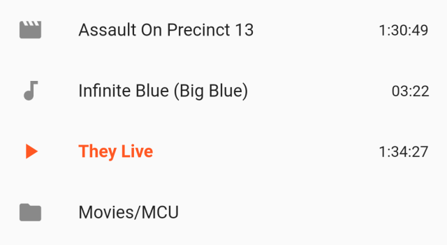
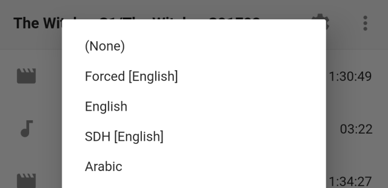
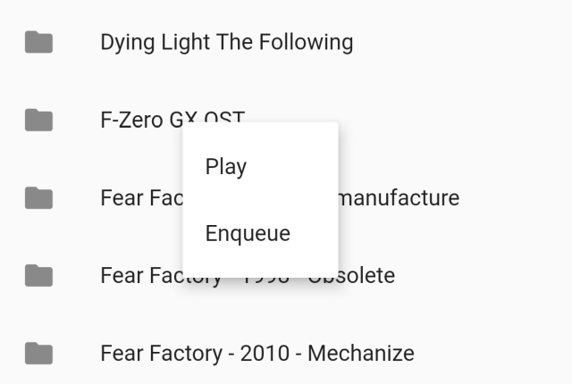
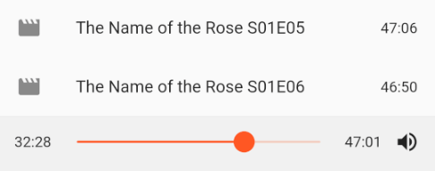

*The Google Play Store only gives you 500 characters to tell people what's new, so here's a more complete rundown for v1.2.0 of [VLC Remote](https://play.google.com/store/apps/details?id=jbscript.vlcremote), my [open source](https://github.com/insin/vlc_remote) and ad-free Android remote control app for [VLC media player](https://www.videolan.org/vlc):*

## 🦋 Upgraded to Flutter v1.17

It's been a while since the last stable release of Flutter, but version 1.17 [has just been released](https://medium.com/flutter/announcing-flutter-1-17-4182d8af7f8e), promising "faster animations, smaller apps and lower memory utilization" for users, so that's an easy upgrade.

We'll also have a look at the snazzy-looking new [`animations` package](https://pub.dev/packages/animations) to see if there's something we can use in future releases.

## 🐞 Bug fixes

- Using the relative volume controls, it's possible to set VLC's volume to a negative value or a value higher than its maximum.

  Fixed a crash caused by VLC sending one of these out-of-range volume values back to the app.

- Status and playlist responses from VLC weren't being decoded correctly, causing non-Latin-1 characters to be garbled when displayed.

  These are now being decoded as UTF-8.

## 📄 Playlist improvements

The main playlist view has had some enhancements made this release:

- The running time/track length of media is now displayed.
- Suitable file type icons are now displayed.
- The current playlist item now reflects VLC's playing/paused/stopped state.
- VLC supports adding directories to playlists, so support has been added for directory playlist items.

When you try to play a directory, VLC will replace it with everything inside the directory and start playing the first item within it. It's… a bit weird, but that's VLC 😊

The ⋮ → "Select subtitle track" menu has gained a new "(None)" option which lets you disable subtitles:

## 🗄 File browser improvements

When using the file browser, you can now **long-press to open a menu** for an item, allowing you to play it as usual, or enqueue it if you want to stay in the file browser to keep adding more items to your playlist.

Now that the app can handle directory playlist items, we've also enabled long-pressing on a directory to play or enqueue its contents:

## 🔊 Improved volume controls

Previously, volume controls were always displayed below the playlist.

Now volume controls are hidden by default, and will slide into view when you tap the new volume icon next to the seek bar.

There have also been a number of improvements to volume control:

- When using the volume slider, it now displays a label showing the current volume % (as per VLC's % display)
- Muting the volume is now handled by long-pressing the new volume icon - the previous volume will be restored when un-muting.
- The relative volume change made by tapping the - or + buttons has been increased to something more useful.

Volume controls can be hidden by tapping the volume icon again or waiting a short time.

By default they'll slide back in if you don't interact with them within 4 seconds. After interacting with them, they'll automatically hide 2 seconds after you've finished.

Here's an example of the new volume controls in action:

