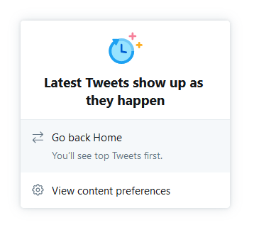
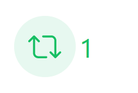
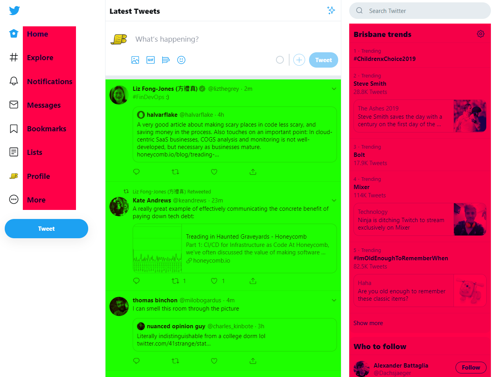
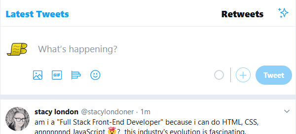
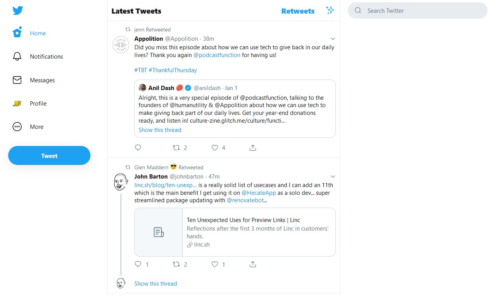
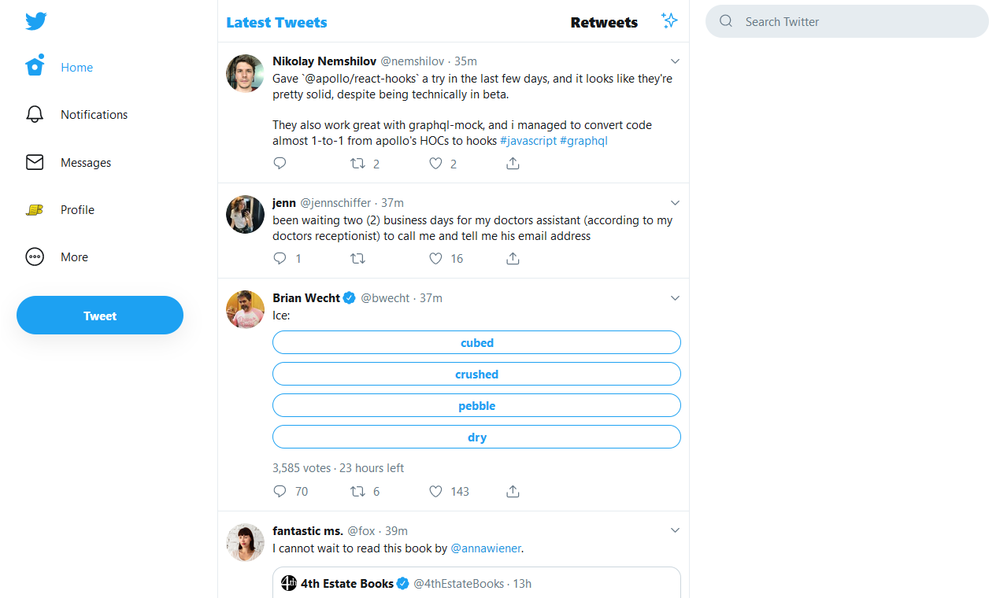
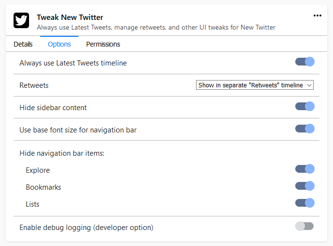

## The problem: "engagement" came back

It can take a few screenfuls of Tweets before you realise you're reading warmed-over old news, Tweets you're sure you've read before and clickbait recommendations.

It starts as a feeling in the back of your mind, then suddenly it twigs that something's not right. Twitter has once again taken you off the chronological Latest Tweets timeline and put you back on the algorithmic "Home" timeline they'd rather you were reading, which (allegedly) contains "top Tweets".

Meanwhile, somebody on Twitter reads a tweet which makes them feel mad, or sad, or something else entirely. They hit the retweet button. Number goes up. Because you follow that person, those tweets are now in your timeline too, and perhaps some of those same feelings are how happening in your mind too.

Champagne corks pop in Twitter's Analytics department. "Engagement" has occurred.  Perhaps you click through, or browse a little longer than you intended to. Perhaps _you're_ now feeling mad, or sad, or something else entirely just because you opened Twitter to see what the people you follow were saying.

*Cui bono*? Who really benefits from this? After using the old desktop site for more than a year with [an extension which removed these elements](https://github.com/insin/manage-twitter-engagement#manage-twitter-engagement) and re-experiencing the feeling of "engagement" afresh when my account got moved over to New Twitter, it was clear this wasn't for my benefit. With retweets back in the game, even the Latest Tweets timeline felt like a noisy, distracting mess.

In addition, some of the layout changes were directing my attention to the wrong places; a main navigation menu which **shouted at me** - mostly about things I don't care about - and irrelevant, distracting sidebar content to the right.

Combined, these made New Twitter feel unusable from both a UX and mental hygiene perspective - like the "hellsite" people refer to it as.

## A solution: [Tweak New Twitter](https://github.com/insin/tweak-new-twitter#tweak-new-twitter)

So I had to create [Tweak New Twitter](https://github.com/insin/tweak-new-twitter#tweak-new-twitter) to make it usable again.

It's available as an extension for [Firefox](https://addons.mozilla.org/en-US/firefox/addon/tweak-new-twitter/) and [Chrome](https://chrome.google.com/webstore/detail/tweak-new-twitter/kpmjjdhbcfebfjgdnpjagcndoelnidfj), or you can install it as a [user script](https://greasyfork.org/en/scripts/387773-tweak-new-twitter) if you'd prefer.

Tweak New Twitter ensures you stay on the Latest Tweets timeline even if Twitter tries to switch you back to "Home", and even if you try to switch _yourself_ back without disabling this feature first!

By default, it will also remove retweets from your main timeline and add a new "Retweets" header which acts like an additional timeline containing just retweets, so you can opt in to what people are sharing, on your terms:

As a result your main timeline will now consist entirely of what the people you follow have to say, in the form of original tweets and quote tweets. It makes Twitter _actually_ about the conversations which are happening again:

It tones down the navigation menu by making it use the page's base font size (respecting your preferred setting from New Twitter's theme configuration dialog) and hiding links to some lesser-used sections. Distracting sidebar content is also hidden by default.

These features are configurable in the extension's options, so if you're not really bothered about retweets, or if you want them gone _entirely_, you can do that. If you use some of the sections navigation is hidden for by default, you can put them back individually:

If you'd like to join in on GitHub, [more features are planned](https://github.com/insin/tweak-new-twitter/issues) and [new feature ideas are welcome](https://github.com/insin/tweak-new-twitter/issues/new).
